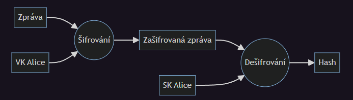

# Formátování popisu

Různá pole ve [specifikaci úlohy](../overview/index.md) umožňují využívat Markdown k formátování textu. Markdown je doporučené využívat zvláště v dlouhých textech a popisech, kde značně zvyšuje čitelnost.

Kromě Markdownu HAXAGON umožňuje v textech úlohy využívat další speciální funkce, jako Zástupce IP adresy nebo Asciinema přehrávač.

## Zástupce IP adresy

Pro vložení IP adresy běžící instance do popisu úlohy je možné použít zástupnou sekvenci `<ip>`. Ta bude po spuštění úlohy nahrazena její IP adresou, a to podle zvoleného typu připojení – veřejná IP / VPN.  
Když úloha neběží, zástupce se zobrazuje jako text `[ip]`.

## Asciinema přehrávač

Jelikož většina našich úloh využívá terminál, může být potřeba studenty naučit a ukázat jim, jak některé příkazy používat. K tomuto účelu je možné využít Asciinema video přehrávač se záznamem terminálu.  
Díky [`asciinema-ce`](https://github.com/haxagoncz/asciinema-ce) je možné použít v Markdownu vlastní HTML element `<asciinema-player>`.

```html
<asciinema-player src="28307"></asciinema-player>
```
Hodnota atributu `src` je id záznamu nahraného na https://asciinema.org/. Je také možné specifikovat další možnosti atributem `options` ve formátu textu s JSONem. Seznam možností je k nalezení v [oficiální dokumentaci](https://asciinema.org/docs/embedding) [anglicky].

## Vkládání kódu

Pokud vkládáme delší kód (např. snippet v bashi, nebo jiném programovacím jazyce), zaobalíme ho do víceřádkového code bloku se zvýrazňováním syntaxe:

    ```jazyk
    // kód
    ```

Jméno programovacího jazyka se vloží za první tři zpětné apostrofy, místo slova `jazyk`.  
Kompletní seznam podporovaných jazyků na zvýraznění syntaxe je [zde](https://highlightjs.readthedocs.io/en/latest/supported-languages.html).


## Podmíněné renderování

Spolu se zástupcem `<ip>` může být potřeba zobrazit nějaký text až když je úloha spuštěná a má vygenerovanou IP adresu. V tu chvíli přichází na řadu podmíněné zobrazování textu: vše ve vlastním html tagu `<if> </if>` který má platnou podmínku bude zobrazenou pouze, pokud se hodnota podmínky rovná `true`.

Aktuálně je v podmínkách možné používat pouze testování, zda má úloha IP adresu.

```html
Toto je normální text.
<if ip>
    Toto se zobrazí jen když má úloha přidělenou IP adresu.
</if>
<if ip="false">
    Toto se zobrazuje, když úloha ještě nemá IP adresu (není spuštěná).
    **Před připojením na úlohu je nutné, aby byla spuštěná.**
</if>
<if ip="true">
    Je možné použít i testování na hodnotu true pro zobrazování textu jen u spuštěné úlohy.
</if>
```

## LaTeX

V markdown souborech je možné využít LaTeX syntaxi pro zobrazení matematických výrazů. (Konkrétně díky balíčkům [remark-math](https://github.com/remarkjs/remark-math) a [rehype-katex](https://github.com/remarkjs/remark-math/tree/main/packages/rehype-katex).)

LaTeX kód vložte mezi znaky dolaru (`$4\times10^2=400$`) pro inline vložení, nebo je možné použít [code blok](#vkladani-kodu) a jako "programovací jazyk" použít `math`.

Více informací o LaTeXu a KaTeXu je možné najít třeba zde: https://katex.org/docs/supported, https://www.overleaf.com/learn/latex/Mathematics.

## Mermaid.JS

V markdown souborech je také možné používat `mermaid` code bloky pro zobrazení všelijakých diagramů a grafů. Kupříkladu:

    ```mermaid
    flowchart LR
        Zpráva-->enc
        vk_alice[VK Alice]-->enc((Šifrování))
        enc-->msg[Zašifrovaná zpráva]
        msg-->dec((Dešifrování))
        sk_alice[SK Alice]-->dec
        dec-->Hash
    ```
se zobrazí jako: 



Všechny detaily o typech diagramů a syntaxi je možné najít v oficiální dokumentaci: https://mermaid.js.org/intro/.