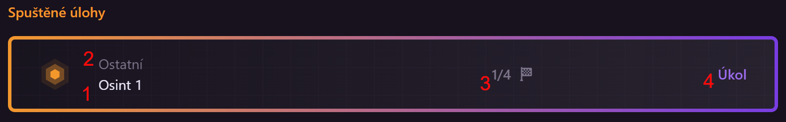

# Základní používání platformy HAXAGON

Studenti jsou na platformě rozděleni do skupin, které většinou představují třídy, popřípadě skupiny, do kterých chodí. Veškerá cvičení a úkoly se zadávají právě pro určité skupiny a Žebříčky také fungují v rozsahu skupin.

Po přihlášení do systému je nutné vybrat, kterou skupinu chce uživatel právě používat. Ve většině případů se budou studenti nacházet pouze v jedné, takže není z čeho volit. Automaticky by se mělo otevřít levé menu, v něm vyberte skupinu jednoduchým kliknutím na jméno skupiny.   
Pokud se menu neotevřelo, klikněte v levém horním rohu, pod logem HAXAGONu, na ikonu "Ž" (nebo nápis "Žádná skupina", pokud máte menu rozbalené).

Pro změnu aktuálně vybrané skupiny je postup velmi podobný – vlevo nahoře klikněte na jméno aktuální skupiny, což otevře seznam všech Vašich skupin.

## Základní prvky stránky

Navigační menu v levé části obsahuje několik podstránek. Pro studenty to jsou tyto:
- [Přehled](#prehled)
- [Katalog](#katalog)
- [Žebříčky](#zebricky)
- [Battlefield](../battlefield/index.md)
- [Dokumentace](/)
- [Discord](https://discord.gg/Z3bn4EyE3H)
- Profil, který po rozkliknutí zpřístupní možnosti:
    - [Nastavení](#nastaveni)
    - [VPN Konfigurace](#vpn-konfigurace)
    - Odhlásit se

## Přehled

Zde studenti vidí přehled všech svých zadaných úloh, testů a cvičení.

V levém sloupci jsou vidět všechny dokončené úlohy, to znamená úlohy, kde student splnil všechny vlajky; případně úlohy, kde mu došly pokusy nebo vypršel čas. Na takovýchto úlohách již student nemůže dál pracovat, pokud mu je vyučující neresetuje nebo mu neprodlouží čas.  
Kliknutím kamkoliv do prostoru jména úlohy se dostanete na detail úlohy.  
Úlohy jsou řazené sestupně, podle dne dokončení.

V pravém sloupci jsou všechny zadané a rozpracované úlohy, řazené podle data zadání, od nejstarších k nejnovějším. Opět je zde možné se dostat na detail jednotlivých úloh kliknutím na jejich jméno.

V prostředku jsou zobrazeny aktuálně běžící úlohy, aby nebyly potřeba složitě hledat. Zobrazují se základní informace o úloze:  

1. Jméno
2. Okruh úloh, do kterého patří
3. Počet splněných vlajek / celkový počet vlajek
4. Typ úlohy: úkol / test

&nbsp;

A v neposlední řadě je zcela nahoře vidět základní statistika o postupu studenta – Celkový počet vlajek, které vyřešil a procentuální vyjádření ze všech vlajek všech zadaných úloh.

## Katalog

Katalog je místo pro studenty i učitele, kde si můžou projít úlohy, které jsou zde (na rozdíl od stránky [Přehled](#prehled)) uspořádané do tematických kategorií. Každá úloha zde má krátké shrnutí, aby bylo rychle jasné, čemu se věnuje, dále pak datum, kdy ji student dostal zadanou k vyřešení a počet jejích vlajek.

Vyhledávat úlohy v horní části lze jak podle jejich jména, tak i podle jména jejich kategorie. Vyhledávací políčko je možné také aktivovat klávesou `/`.  
Po vyhledání úlohy se otevře zobrazení kategorie s rozbaleným krátkým shrnutím vybrané úlohy, aby uživatel jednoduše viděl, co dané úloze předchází a co následuje.

V detailu každé kategorie jsou vidět pouze ty úlohy, které má žák zadané od svého učitele.

V pravé části jsou opět statistiky o studentově postupu kategorií – Počet splněných vlajek z úloh této kategorie a jejich procentuální vyjádření k celkovému počtu vlajek v kategorii.  
Hned pod tím je celkový počet úloh v kategorii, včetně těch, které žák nemá zadané. A jako poslední může student v pravém panelu vidět, které úlohy z těch zadaných má dokončené (číslice je zelená) a které mu ještě chybí (šedá).

## Žebříčky

Žebříčky poskytují studentům okamžitou informaci o jejich postupu ve třídě nebo v soutěži. Každá splněná vlajka v úloze přidá studentovi určitý počet bodů za její úspěšné vyřešení. Zcela nahoře je vidět posledních několik vlajek, které student splnil, a kdy se tak stalo.

Tři studenti s nejvyšším počtem bodů v aktuálně vybrané skupině se zobrazují na "stupních vítězů", spolu s jejich vybraným avatarem.

Všichni studenti jsou také řazeni postupně v tabulce, podle svých bodů. Pro jednoduché zobrazení jsou také jejich body reprezentovány grafem – počet bodů nejlepšího studenta se ukazuje jako plný řádek, ostatní studenti mají svůj progress bar vyplněný proporcionálně k tomu. 

## Nastavení

V nastavení si každý může trochu přizpůsobit platformu HAXAGON k obrazu svému. Také si zde studenti mění vzhled svého profilu.

### Discord integrace
Pro přístup na [komunitní Discord server](https://discord.gg/Z3bn4EyE3H) je potřeba ověřit, že jste skutečně uživateli HAXAGONu. Pro to se používá autorizace discord účtem.

Pro propojení klikněte na tlačítko s logem Discord vlevo nahoře. To Vás přesměruje na stránky discord.com, kde povolíte přístup ke jménu Vašeho účtu. Pokud nejste v prohlížeči přihlášení do Discordu, budete se muset přihlásit.

Po propojení účtů můžete pokračovat na Discord server a řídit se pokyny pro ověření napsanými v kanálu [#verification](https://ptb.discord.com/channels/1045285681536180255/1111758661128290325).

### Avatar
Avatar si lze vybrat z několika předvytvořených možností, které se zpřístupní po kliknutí na na aktuální profilový obrázek. Nahrávání vlastních fotek možné není.  
Uživatelský avatar se poté zobrazuje na několika místech: V Žebříčcích, v seznamu řešitelů úlohy a učitelé ho vidí v seznamu svých studentů. Pokud se student a škola účastní [Battlefieldu](/students/battlefield/index.md), avatar se zobrazuje v žebříčku i tam.

### Jazyk
Webová stránka HAXAGON je dostupná jak v češtině, tak v angličtině. Pokud někde naleznete chybějící překlad, nahlaste ho, prosím, na našem [discord serveru](https://discord.gg/Z3bn4EyE3H).

### Připojení
Zde je možnost nastavit výchozí způsob připojení k úlohám.  
Doporučené je používat možnost "Veřejná IP".  
V&nbsp;některých vzácnějších případech může být nutné použít k připojení možnost "VPN", například pokud jsou ve školních sítích blokované některé síťové protokoly (SSH aj.). V takovém případě je třeba nastavit VPN a stáhnout přihlašovací údaje k tunelu, viz [VPN Konfigurace](#vpn-konfigurace).

### Mód zobrazení
Pro běžné používání je silně doporučený Normální mód (tmavý), ale v situacích, kdy je obrazovka platformy HAXAGON promítána na příklad na méně kontrastních projektorech, může být vhodnější použít světlý projektor mód. 

## VPN Konfigurace

Pro připojení do většiny úloh je možné se připojit pomocí veřejných IP adres, pro některé ale může být nutné využít VPN.

Stránka VPN Konfigurace obsahuje všechny potřebné informace k nastavení VPN na Vašem oblíbeném operačním systému. Možnost pro váš aktuálně používaný operační systém by se měla detekovat automaticky, zvýraznit a zobrazit v seznamu na prvním místě. Pokud se toto nestane, jednoduše vyberte svůj OS ze seznamu a klikněte na tlačítko "Nastavit VPN".

Poté stačí následovat kroky na stránce pro instalaci VPN klienta, import konfiguračního souboru a spuštění VPN připojení.  
Návody pro Linux a macOS/OS X obsahují také předpřipravený shell script, který stačí vložit do příkazové řádky a spustit. Příkaz obsahuje Vaši VPN konfiguraci a automaticky Vás připojí na VPN.

::: danger Pozor!
Nikdy s nikým nesdílejte svůj `.conf` VPN soubor / QR kód pro mobilní zařízení / shell příkaz na připojení!  
Obsahuje údaje pro připojení k HAXAGON úlohám pod Vaším účtem!
:::