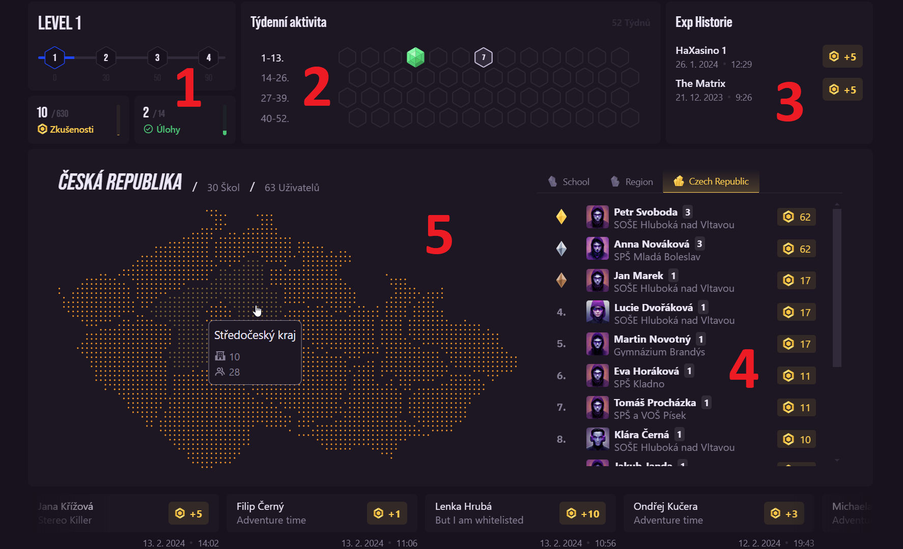

# Základní používání Battlefield zóny
Battlefield je prostor pro studenty poměřit své síly s ostatními v rámci své školy, kraje, nebo i celé republiky.

Je postaven na úlohách podobných těm využívaným ve výuce, ale obecně více "soutěžového typu" – úlohy mohou být i významně těžší a neobsahují žádnou teorii.

<!--TODO: link na podmínky, které uživatel musí akceptovat, aby si je mohli přečíst i pak / předem -->
Pro přístup do Battlefieldu je nutné akceptovat podmínky užití<!--[Podmínky užití](#)-->, které se věnují zejména soutěžnímu fair-play.

 

# Úvodní obrazovka
Na první obrazovce je vidět přehled postupu uživatele v rámci soutěžení a osobního růstu.

## 1 – Úroveň
Za každou vlajku každé úlohy je možné získat určitý počet Zkušenostních bodů  (XP).

Jejich akumulací uživatel získává úrovně, které se následně ukazují u jeho jména. V této dlaždici je také vidět přehled získaných XP (a kolik zkušenostních bodů je celkem aktuálně možné získat) a počet splněných úloh (z celkového počtu dostupných).

## 2 – Týdenní aktivita
Za každý týden, kdy uživatel splní alespoň jednu úlohu, se zabarví odpovídající hexagon. Cílem řešitele může být kompletně zelená plástev!

## 3 – Exp Historie
Vedle týdenní aktivity se nacházejí 3 nejnovější vlajky, které uživatel vyřešil a body , které za ně získal. 
<!--TODO: Až budou firstbloody, doplnit, že je to vlastně souhrn XP a ne jen vlajek -->

## 4 – Žebříčky
Jedna z ústředních částí zóny Battlefield jsou žebříčky, které ukazují nejlepší studenty ve škole, kraji a celé České republice.  
Studenti jsou řazeni podle množství XP , které získali za řešení jednotlivých úloh. U každého studenta se také ukazuje škola, kterou navštěvuje a úroveň jeho účtu.

## 5 – Mapa České republiky
Mapou je možné ovládat, která data jsou zobrazena v žebříčcích, konkrétně v záložce "Kraj".

Při najetí kurzorem na jednotlivý kraj se zobrazí jednoduché shrnutí, kolik je v daném kraji škol zapojených do Battlefieldu a celkový počet studentů v těchto školách, soutěžících v rámci Battlefieldu.

Mapa není dostupná na malých obrazovkách, jako jsou mobilní zařízení. Na těch je možné ovládat zobrazení žebříčků pouze záložkami v horní části tabulek – škola řešitele, jeho kraj anebo celá republika.

Pod mapou se nachází posouvající se přehlídka 20 nejnovějších vlajek, které řešitelé splnili napříč celou soutěží. Vlajky je možné pozastavit najetím myší.

 

# Nejnovější úlohy
Nově přidané úlohy, u kterých je nejvyšší šance se umístit v horních příčkách tabulky, se ukazují zde.  
Každá dlaždice obsahuje všechny informace, které student potřebuje k rozhodnutí se, kterou úlohou chce začít:
- Nadpis úlohy
- Krátký popisek
- Obtížnost (Začátečník → Mistr)
- Počet vlajek v úloze
- Celkový počet XP , které je možné získat za vyřešení celé úlohy

Kliknutím na dlaždici je možné se přesunout detail úlohy, kde je možné ji začít řešit.

## Nadcházející úlohy
Pokud je oznámené a naplánované vydání dalších úloh, zobrazují se také v této sekci.  
Dlaždice opět obsahují základní informace s tím rozdílem, že úlohu není možné rozkliknout a přes ilustrační obrázek je umístěn odpočet, který přesně ukazuje, kdy bude úloha uvolněna k řešení.

 

# Seznam úloh
Na konci stránky se nachází chronologický seznam všech úloh, které již byly do Battlefieldu vydány. Zde je možné jednoduše rozeznat, které úlohy má již uživatel splněné a které ho ještě čekají. Do detailu úlohy je možné se dostat jednoduchým proklikem přes odpovídající dlaždici.

U každé úlohy je možné vidět stejné informace jako u čerstvě vydaných úloha, pouze v kompaktnějším provedení. 

 

# Stránka detailu úlohy
Stránka detailu úlohy je vcelku stejná jako ve standardních úlohách, [základní popis je tedy zde](/students/challenges/).

Jedním z rozdílů je absence všech záložek, jako "Teorie" a "Řešitelé"; je zde pouze ekvivalent záložky "Vlajky".

Žebříček řešitelů se nachází v pravém horním rohu stránky a je řazen podle rychlosti vyřešení.  
U každého úspěšného řešitele je zobrazen čas přesný na sekundy, který ukazuje, kdo úlohu vyřešil nejdříve po jejím zpřístupnění.

U úloh, které vyřešilo více studentů, je možné vyhledávat jednotlivé řešitele a jejich umístění v tabulce pomocí vyhledávacího políčka, vedle kterého se také nachází tlačítko pro aktualizaci dat. To se hodí zejména u nových úloh, kde noví řešitelé přibývají relativně rychle.