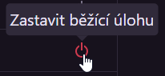
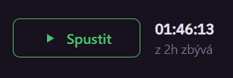
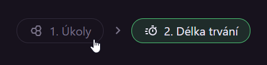

# Základní používání platformy HAXAGON pro učitele a lektory

::: info
Celá tato sekce předpokládá znalost funkcí platformy z pohledu studentů.  
Pro lepší porozumnění si proto nejdříve projděte [studentskou sekci](./../../students/).
:::

# Odlišnosti od studentského rozhraní

Učitelé vidí na některých stránkách více věci, než studenti. V této sekci si probereme právě tyto rozdíly.

## Detail úlohy

Každou úlohu si učitelé mohou spustit, stejně jako jejich žáci. Navíc ale v detailu každé úlohy mají k dispozici několik nástrojů a informací navíc.

### Příručka

První z nich je záložka "Příručka", která se se nachází těsně pod krátkým popisem úlohy, vedle záložek "Vlajky" a "Řešitelé". Tedy pokud ji daná úloha má definovanou. Může se stát, že autor úlohy příručku vynechá.

V příručce standardně bývá opsané zadání úkolů a podrobné návody, jak postupovat při jejich řešení. Ty mohou posloužit učitelům při výkladu a vysvětlování některých metod, nebo třeba když potřebují popostrčit studenta k vyřešení některého z úkolů.

### Uživatelé

Druhou záložkou exkluzivně pro učitele jsou "Uživatelé". Tam jsou vypsáni věichni studenti, kteří mají úlohu zadanou.  
Vedle každého studenta je vidět status jeho instance úlohy (offline, splněná, běžící, spouštění nebo zastavování).  
U každého studenta se také zobrazuje v reálném čase počet vlajek, které splnil.

Učitel má několik možností, jak spravovat instance úlohy:

- U běžících instancí může zcela vpravo vybrat možnost "Zastavit běžící úlohu"

- V levé části tabulky může zaškrtávacími políčky vybrat více studentů, kterým chce zastavit úlohu, což provede tlačítkem nad tabulkou.  
  Toto se hodí třeba po hodině, když si studenti zapomenou vypnout úlohy - stačí zaškrtnou všechny tlačítkem v hlavičce tabulky a hromadně instance zastavit.

- Nebo pokud při [zadávání úlohy](#zadavani-uloh) v počátku špatně odhadl potřebný čas, nebo prostě jen studentům čas vypršel, může všem studentům resetovat čas na plnou původní hodnotu tlačítkem nad tabulkou.

<!--- 
TODO: doplnit mazání vyřešených vlajek: Uživatelé-> klik na uživatele -> smazat vlajku  => takhle se dá obnovit počet pokusů.
--->

<!--- 
TODO: doplnit reset času pro jednoho studenta - pořád not sure, jak se to dělá??
--->

### Mazání úlohy

Posledním z administrativních nástrojů je možnost smazat zadanou úlohu.

Tím zmizí studentům ze stránky [Přehled](/students/basics/index.md#prehled), z [Katalogu](/students/basics/index.md#katalog) a body, které za úlohu získali, se jim odečtou z žebříčků.

::: warning Pozor!
Mazání úlohy nevyžaduje potvrzení, takže pozor na ukliknutí-se –⁠ smazání úlohy smaže studentům i všechen jejich postup v dané úloze.
<!--- 
TODO: až začne tlačítko vyžadovat potvrzení, smazat tohle.
--->
:::

## Katalog

Na stránce katalog vidí učitelé, na rozdíl od studentů, všechny dostupné okruhy úloh. U každého okruhu navíc mají v pravém horním rohu informaci, kolik úloh je zadaných právě vybrané skupině.

V detailu kategorie jsou zadané úlohy rozlišeny barvou čísla a textem "Zadáno" pod jménem každé úlohy.

Více o zadávání úloh dále na této stránce v sekci [Zadávání Úloh](#zadavani-uloh).

## Žebříčky

Jediný dozdíl pro učitelské účty na stránce Žebříčky je živý záznam vlajek v horní části stránky. Učitelům se zde ukazují všechny nové vlajky všech studentů v právě vybrané skupině.

# Zadávání úloh

Proces zadávání úloh začíná v [Katalogu úloh](/students/basics/index.md#katalog). Zde si učitelé mohou projít všechny úlohy podle kategorií, prohlédnout si jejich teorii i Příručku s postupem řešení.  
V každé kategorii je jasně vidět, které úlohy jsou již pro vybranou skupinu zadané a které ještě ne.

Zadávání funguje podobnou formou, jako nákupní košíky v e-shopech: Vyberete položky (úlohy), tlačítkem "Přidat" je přidáte do Košíku, který si je pamatuje napříč celou webovou stránkou –⁠ můžete si tedy libovolně prohlížet detaily úloh. Košík také fugnuje mezi jednotlivými kategoriemi v Katalogu, můžete tedy přidat jednu úlohu z kategorie "Web", vrátit se do přehledu a vybrat další úlohu na příklad z kategorie "Crypto".  
Pro zadání všech úloh z kategorie lze použít tlačítko nad seznamem úloh, pod popiskem kategorie.

## Košík

Košík vybraných úloh pro zadání se nachází v pravé části obrazovky (nebo zcela nahoře na mobilních telefonech).

Na vrchu košíku je jednoduché shrnutí zadání, tedy kolik celkových úloh bude zadáno a jaký je souhrnný odhadovaný čas potřebný pro vyřešení.

Dále jsou podrobnější informace o jednotlivých úlohách: Jejich jméno, počet vlajek, odhadovaná časová náročnost a štítky.  
Pořadí, v jakém jsou zde úlohy vylistovány nemá žádný význam, je to pouze pořadí, ve kterém je učitel vybral.  

Každou úlohu je možné odebrat z košíku několika způsoby:

- V seznamu úloh v rámci kategorie bude mít úloha, která je v košíku, vedle sebe tlačítko "Odebrat"
- Přímo v košíku má vedle sebe každá úloha malý červený křížek
- Nad seznamem úloh v košíku je také možnost košík vyprázdnit tlačítkem "🗑 Vše"

## Zadání délky úloh

Pokud jste spokojeni se seznamem vybraných úloh pro zadání, pokračujte tlačítkem "Zadat úlohy" na spodku košíku.

Na této obrazovce je možné nastavit kolik času budou mít studenti na vyřešení úloh.  

Délka úlohy znamená čas, po který mají studenti povoleno mít úlohu spuštěnou a pracovat na ní, tedy čas, po který poběží servery a za který bude škola účtována.  
Na některých úlohách je možné pracovat i bez spuštění, pokud obsahují všechny informace k řešení v popisku. Většinou je ale potřeba úlohy pro práci spouštět, aby se studenti mohli připojit na simulované zařízení.

::: tip
Vybraný čas se aplikuje pro všechny vybrané úlohy. Pro nastavení rozdílného času pro různé úlohy je nutné zadat úlohy jednotlivě.
:::

Čas je možné vybrat buďto výberem z možností v levé části, nebo posuvníkem. Oba mají stejnou funkci.

Pod délkou úloh je krátké shrnutí zadání: Které skupině budou úlohy zadány a o kterou skupinu se jedná.

::: tip
Kdykoliv během procesu zadávání je možné [změnit skupinu](/students/basics/index.md#zakladni-pouzivani-platformy-haxagon) výběrem v horní části navigačního menu stránky.
:::

 

::: info
V budoucnu v této sekci přibudou i další možnosti nastavení, na příklad možnost uveřejnit zadané úlohy až od zadaného data a času nebo podobné vychytávky.
:::

Pokud chcete v tomto kroku upravit, které úlohy se zadají, využijte tlačítko "1. Úkoly" zhruba vprostřed stránky pod shrnutím počtu a odhadované délky úloh.  

  

Celý proces zadávání se ukončí tlačítkem "Zadat úlohy", které zpřístupní vybrané úlohy studentům. 

# Správa skupin

::: info INFO ⚒
Tato stránka není hotová a je stále v procesu psaní.
:::

