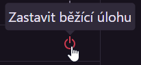
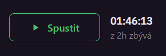
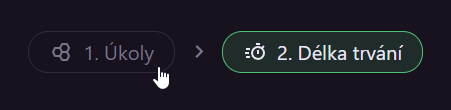

# Základní používání platformy HAXAGON pro učitele

::: info
Celá tato sekce předpokládá znalost funkcí platformy z pohledu studentů.  
Pro lepší porozumění si proto nejdříve projděte [studentskou sekci](./../../students/).
:::

::: tip Pro správce organizace
Pokud jste **správce organizace**, máte rozšířená oprávnění – vidíte všechny skupiny a uživatele v organizaci, můžete povyšovat učitele na správce a další. Více v [dokumentaci pro správce](/admins/).
:::

# Odlišnosti od studentského rozhraní

Učitelé vidí na některých stránkách více věcí než studenti. V této sekci si probereme právě tyto rozdíly.

## Detail úlohy

Každou úlohu si učitelé mohou spustit, stejně jako jejich žáci. Navíc ale v detailu každé úlohy mají k dispozici několik nástrojů a informací navíc.

### Příručka

První z nich je záložka "Příručka", která se se nachází těsně pod krátkým popisem úlohy, vedle záložek "Vlajky" a "Řešitelé". Tedy pokud ji daná úloha má definovanou. Může se stát, že autor úlohy příručku vynechá.

V příručce standardně bývá opsané zadání úkolů a podrobné návody, jak postupovat při jejich řešení. Ty mohou posloužit učitelům při výkladu a vysvětlování některých metod, nebo třeba když potřebují popostrčit studenta k vyřešení některého z úkolů.

### Uživatelé

Druhou záložkou exkluzivně pro učitele jsou "Uživatelé". Tam jsou vypsáni všichni studenti, kteří mají úlohu zadanou.  
Vedle každého studenta je vidět status jeho instance úlohy (offline, splněná, běžící, spouštění nebo zastavování).  
U každého studenta se také zobrazuje v reálném čase počet vlajek, které splnil.

Učitel má několik možností, jak spravovat instance úlohy:

#### Vypínání úloh
Učitel má možnost zastavovat svým studentům běžící instance úlohy. Toho může dosáhnout několika způsoby:
- U běžících instancí může zcela vpravo vybrat možnost "Zastavit běžící úlohu"

- V levé části tabulky může zaškrtávacími políčky vybrat více studentů, kterým chce zastavit úlohu, což provede tlačítkem nad tabulkou.  
  Toto se hodí třeba po hodině, když si studenti zapomenou vypnout úlohy – stačí zaškrtnou všechny studenty tlačítkem v hlavičce tabulky a hromadně instance zastavit.

#### Správa času
Pokud učitel při [zadávání úlohy](#zadavani-uloh) v počátku špatně odhadl potřebný čas, nebo prostě jen studentům čas vypršel, může všem studentům resetovat čas na plnou původní hodnotu tlačítkem nad tabulkou.

#### Resetování vlajek
Po kliknutí na řádek studenta v tabulce "Uživatelé" se otevře detail studenta. Zde je možné vidět všechna jednotlivá odevzdání vlajek –⁠ úspěšné i chybné.  
Učitel má možnost jakékoliv odevzdání smazat. To buďto křížkem (×) u každého řádku, nebo hromadně vybráním řádků po levé straně.  
Tímto lze studentovi "přidat" pokusy na řešení vlajky, ale i resetovat úlohu, aby si ji mohl vyřešit znovu, bez nutnosti ji celou zadávat.

### Mazání úlohy

Posledním z administrativních nástrojů je možnost smazat zadanou úlohu.

Tím zmizí studentům ze stránky [Přehled](/students/basics/index.md#prehled), z [Katalogu](/students/basics/index.md#katalog) a body, které za úlohu získali, se jim odečtou z žebříčků.

::: warning Pozor!
Mazání úlohy smaže studentům všechen jejich postup v dané úloze. Před smazáním se ujistěte, že to opravdu chcete.
:::

## Katalog

Na stránce katalog vidí učitelé, na rozdíl od studentů, všechny dostupné okruhy úloh. U každého okruhu navíc mají v pravém horním rohu informaci, kolik úloh je zadaných právě vybrané skupině.

V detailu kategorie jsou zadané úlohy rozlišeny barvou čísla a textem "Zadáno" pod jménem každé úlohy.

Více o zadávání úloh dále na této stránce v sekci [Zadávání Úloh](#zadavani-uloh).

## Žebříčky

Jediný rozdíl pro učitelské účty na stránce Žebříčky je živý záznam vlajek v horní části stránky. Učitelům se zde ukazují všechny nové vlajky všech studentů v právě vybrané skupině.

# Zadávání úloh

Proces zadávání úloh začíná v [Katalogu úloh](/students/basics/index.md#katalog). Zde si učitelé mohou projít všechny úlohy podle kategorií, prohlédnout si jejich teorii i Příručku s postupem řešení.  
V každé kategorii je jasně vidět, které úlohy jsou již pro vybranou skupinu zadané a které ještě ne.

Zadávání funguje podobnou formou, jako nákupní košíky v e-shopech: Vyberete položky (úlohy), tlačítkem "Přidat" je přidáte do Košíku, který si je pamatuje napříč celou webovou stránkou –⁠ můžete si tedy libovolně prohlížet detaily úloh. Košík také funguje mezi jednotlivými kategoriemi v Katalogu, můžete tedy přidat jednu úlohu z kategorie "Web", vrátit se do přehledu a vybrat další úlohu na příklad z kategorie "Crypto".  
Pro zadání všech úloh z kategorie lze použít tlačítko nad seznamem úloh, pod popiskem kategorie.

## Košík

Košík vybraných úloh pro zadání se nachází v pravé části obrazovky (nebo zcela nahoře na mobilních telefonech).

Na vrchu košíku je jednoduché shrnutí zadání, tedy kolik celkových úloh bude zadáno a jaký je souhrnný odhadovaný čas potřebný pro vyřešení.

Dále jsou podrobnější informace o jednotlivých úlohách: Jejich jméno, počet vlajek, odhadovaná časová náročnost a štítky.  
Pořadí, v jakém jsou zde úlohy vylistovány nemá žádný význam, je to pouze pořadí, ve kterém je učitel vybral.  

Každou úlohu je možné odebrat z košíku několika způsoby:

- V seznamu úloh v rámci kategorie bude mít úloha, která je v košíku, vedle sebe tlačítko "Odebrat"
- Přímo v košíku má vedle sebe každá úloha malý červený křížek
- Nad seznamem úloh v košíku je také možnost košík vyprázdnit tlačítkem "🗑 Vše"

## Zadání délky úloh

Pokud jste spokojeni se seznamem vybraných úloh pro zadání, pokračujte tlačítkem "Zadat úlohy" na spodku košíku.

Na této obrazovce je možné nastavit kolik času budou mít studenti na vyřešení úloh.  

Délka úlohy znamená čas, po který mají studenti povoleno mít úlohu spuštěnou a pracovat na ní, tedy čas, po který poběží servery a za který bude škola účtována.  
Na některých úlohách je možné pracovat i bez spuštění, pokud obsahují všechny informace k řešení v popisku. Většinou je ale potřeba úlohy pro práci spouštět, aby se studenti mohli připojit na simulované zařízení.

::: tip
Vybraný čas se aplikuje pro všechny vybrané úlohy. Pro nastavení rozdílného času pro různé úlohy je nutné zadat úlohy jednotlivě.
:::

Čas je možné vybrat buďto výběrem z možností v levé části, nebo posuvníkem. Oba mají stejnou funkci.

Pod délkou úloh je krátké shrnutí zadání: Které skupině budou úlohy zadány a o kterou skupinu se jedná.

::: tip
Kdykoliv během procesu zadávání je možné [změnit skupinu](/students/basics/index.md#zakladni-pouzivani-platformy-haxagon) výběrem v horní části navigačního menu stránky.
:::

 

Pokud chcete v tomto kroku upravit, které úlohy se zadají, využijte tlačítko "1. Úkoly" zhruba vprostřed stránky pod shrnutím počtu a odhadované délky úloh.  

  

Celý proces zadávání se ukončí tlačítkem "Zadat úlohy", které zpřístupní vybrané úlohy studentům. 

# Správa uživatelů
Na stránce "Spravovat" → "Uživatelé" se nachází seznam všech uživatelů, kteří jsou v učitelem spravovaných skupinách.  
Každý uživatel zde má seznam skupin a datum registrace pro rychlou orientaci.

## Detail uživatele
Po kliknutí na uživatele v tabulce se zobrazí detail jeho profilu. Zde je možné změnit studentovo jméno, e-mailovou adresu či mu nastavit nové heslo, v případě, že přijde o přístup k původnímu registračnímu e-mailu. Také je zde možnost spravovat, do kterých skupit student patří.

## Import uživatelů z CSV
Pro jednodušší přidávání studentů do systému, např. na začátku školního roku/soutěže, existuje možnost importovat uživatele z `.csv` souboru a pozvat je tak hromadně.  
Soubor nemusí mít nějaké specifické formátování, pouze je nutné, aby obsahoval alespoň 3 sloupce, a to pro jméno, příjmení a e-mailovou adresu. Nemusí mít žádné konkrétní názvy, během procesu importu je možnost si zvolit, který ze sloupců je který. Je tudíž možné importovat i z velkých souborů určených pro registraci žáků do školního informačního systému.

Po dokončení výběru sloupců je zde možnost vybrat, které studenty ze souboru chcete pozvat. Také je důležité políčko v levém horním rohu webové stránky, kde se vybírá skupina, do které budou studenti automaticky přidáni po registraci. Automaticky zde bude vybraná aktuálně zvolená skupina učitele, je zde ale možnost skupinu změnit.

Po stisknutí tlačítka "Pozvat uživatele" budou studentům poslány pozvánky na uvedené emailové adresy. O pozvánkách a možnostech práce s nimi více v sekci [Správa skupin](#sprava-skupin).

# Správa skupin
Učitelé si mohou vytvářet skupiny pro své třídy, skupiny v rámci tříd, či třeba jen pro sebe na testování úloh.  
Skupiny se vytvářejí na stránce "Spravovat" → "Skupiny". V pravém horním rohu se nachází tlačítko Přidat skupinu.

V detailu každé skupiny je možné dále spravovat její členy a jejich role.

## Přidávání uživatelů do skupin
Je několik způsobů, jak přidat uživatele/studenty do skupin.
- Tím nejpřímějším je přejít na detail skupiny na stránce "Spravovat" → "Skupiny" a kliknout na zelené tlačítko Přidat uživatele.  
  Zde se Vám otevře okno s možností vyhledat a označit uživatele k přidání. Pak již stačí potvrdit.
- Další možnost, vhodná spíše pro menší operace s jednotlivci, je přejít přes stránku "Spravovat" → "Uživatelé" na detail uživatele. V pravé části se nachází seznam skupin, ve kterých uživatel již je a zde možnost ho do dalších přidat.
- [Import uživatelů z CSV souboru](#import-uzivatelu-z-csv) také přidá nové uživatele do skupiny, funguje ale pouze na vytváření *nových* účtů na platformě HAXAGON. Nelze tak tedy přiřazovat již existující uživatele do skupin.
- I běžné [Přidání uživatele na platformu](#zvani-uzivatelu-na-platformu-haxagon) automaticky přidá uživatele do skupiny, podle toho, do které byl pozván.

## Zvaní uživatelů na platformu HAXAGON
Registrace do systému je pouze na bázi pozvánek, bez nich nelze vytvořit nový účet.  
Jsou dvě možnosti, jak pozvat nového uživatele:
1. V detailu skupiny vybrat v horní části tlačítko Pozvat uživatele a vyplnit e-mailovou adresu, na kterou se má poslat pozvánka. Volitelně je možné zadat i křestní jméno a příjmení. Pokud budou v pozvánce vyplněny, uživatel si je již nemůže při registraci změnit, v opačném případě si je může vyplnit sám.
2. Pozvat uživatele hromadně (vhodné pro větší množství uživatelů), viz [import uživatelů z .csv](#import-uzivatelu-z-csv).

Vytvořené pozvánky je možné vidět ve spodní části stránky detailu skupiny. Zde je také možné získat registrační odkaz pro daného uživatele kliknutím na tlačítko ve sloupci "Odkaz". Ten je možné poslat uživateli libovolnou cestou a umožní mu registrovat se do HAXAGONu, pokud není pohodlné posílat pozvánku na e-mail.  
Pozvánky je také možné smazat výběrem zaklikávacích políček v levé části tabulky.

## Otevřené pozvánky (veřejné odkazy)

Kromě klasických pozvánek na e-mail existuje možnost vytvořit **otevřený registrační odkaz**. Ten může kdokoliv použít k registraci bez nutnosti zadávat e-mail předem.

### Vytvoření otevřené pozvánky
1. V detailu skupiny klikněte na tlačítko **"Vytvořit otevřenou pozvánku"**
2. Vyberte, zda má být uživatel přidán jako **student** nebo **učitel**
3. Volitelně nastavte:
   - **Maximální počet použití** – kolikrát může být odkaz využit
   - **Datum expirace** – do kdy je odkaz platný
   - **Zkrácený odkaz** – pro snadnější sdílení (kratší URL)

### Kdy použít otevřenou pozvánku
- Pro hromadnou registraci na workshopy nebo soutěže
- Když neznáte e-maily studentů předem
- Pro rychlé přidávání do skupiny
- Pro QR kód na plakátech nebo prezentacích (Pozor! Neměl by se dostat do rukou nepovolaných osob!)

### Správa otevřených pozvánek
Vytvořené otevřené pozvánky jsou viditelné v sekci **"Spravovat" → "Pozvánky"**. Zde můžete:
- Zobrazit statistiky použití (kolikrát byl odkaz využit)
- Upravit nastavení pozvánky
- Deaktivovat nebo smazat pozvánku

::: warning Upozornění
Otevřené pozvánky mohou být zneužity, pokud se odkaz dostane k nepovolaným osobám. Doporučujeme:
- Nastavit maximální počet použití
- Nastavit datum expirace
- Po akci odkaz deaktivovat
- Nesdílet odkaz s nepovolanými osobami, např. na webu školy, kde je odkaz dostupný veřejně
:::

## Noví učitelé ve skupině
Všichni uživatelé přidaní do skupiny jsou automaticky klasifikovaní jako "studenti". Pokud byl do skupiny přidán učitel, vyberte ho zaškrtávacím políčkem v seznamu "Studenti" na stránce detailu skupiny, ve které bude učitelem. Po vybrání se zpřístupní nad tabulkou tlačítko "Povýšit na učitele", kterým přidáte vybranému uživateli mj. práva k zadávání úloh a správě uživatelů ve skupině.  
Tento krok je možné vrátit opětovným vybráním uživatele v seznamu a tlačítkem "Ponížit na studenta".

## Odebrání uživatelů ze skupiny
Kdykoliv je možné vybrat studenta či učitele a odebrat ho ze skupiny kliknutím na odpovídající tlačítko "Odebrat Vybrané" nad tabulkou.  
Toto nesmaže uživatele ze systému, pouze bude odebrán ze skupiny. Pro jeho opětovné přidání viz [Přidávání uživatelů do skupin](#pridavani-uzivatelu-do-skupin).

# Export statistik
V postranním menu v kategorii "Spravovat" se nachází také možnost "Statistiky". Tato stránka umožňuje učitelům exportovat různá data o svých studentech a jejich postupu ve výuce.

Po vybrání skupiny (nebo skupin) v levé části obrazovky se zpřístupní menu, umožňující omezit, které úlohy budou do exportu zahrnuty. Jejich status je možné snadno přepínat kliknutím na jejich jméno.

Ve spodní části obrazovky se nastavuje časový rozsah, který se bere v úvahu při exportu dat.
> Pokud není nastavený horní ani spodní limit, budou vyexportována data za celé období používání platformy HAXAGON.

Po nastavení všech parametrů a omezení exportu stačí stisknout jedno z tlačítek zcela dole na stránce: Export ve formátu JSON, ODS nebo XLSX.

Exportovaná data obsahují informace o každém studentovi: počet vyřešených vlajek, získané body, čas strávený na úlohách a detaily jednotlivých odevzdání.