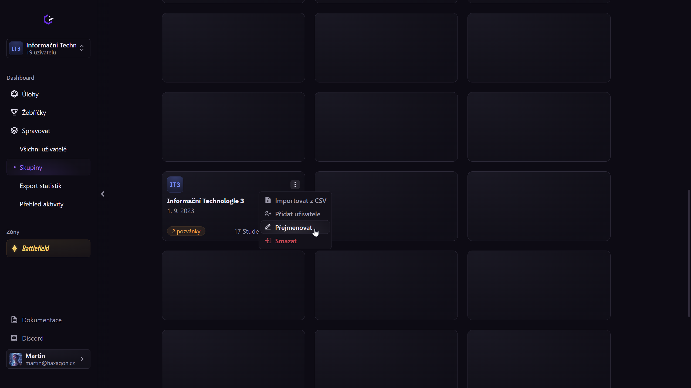

# Začátek nového školního roku

S příchodem nového školního roku se obměňují jména tříd, ale studenti většinou zůstávají a pokračují ve výuce tam, kde v červnu skončili.

V Haxagonu stačí skupinu jednotlivým třídám přejmenovat, studentům tak zůstane jejich postup v úlohách i skóre v žebříčku. 

Možnost na přejmenování se nachází na obrazovce ["Spravovat" → "Skupiny"](/teachers/basics/#sprava-skupin), u každé skupiny zvlášť v jejím menu. Zde vyberte možnost "Přejmenovat" a můžete začít psát nové jméno.  
*(TIP: Pokud možnosti skupiny překrývají konec textu, klikněte kamkoliv do názvu skupiny pro jejich skrytí.)*  
Vložení nového jména stačí potvrdit klávesou Enter.

::: warning Upozornění
Pokud smažete skupinu, studenti ztratí svůj postup úlohami a své skóre v žebříčku.
:::

Pokud někteří studenti nepokračují do dalšího ročníku, je možné je odstranit ze skupiny skrz menu v detailu skupiny, které je dostupné po kliknutí na její dlaždici. Vybrané studenty označte pomocí zaškrtávacích políček a tlačítka "Odebrat vybrané". Tato akce je nesmaže ze systému, ale pouze odebere z aktuální skupiny.  
Do jejich nové skupiny je můžete pozvat přes detail nové skupiny tlačítkem "Přidat uživatele".