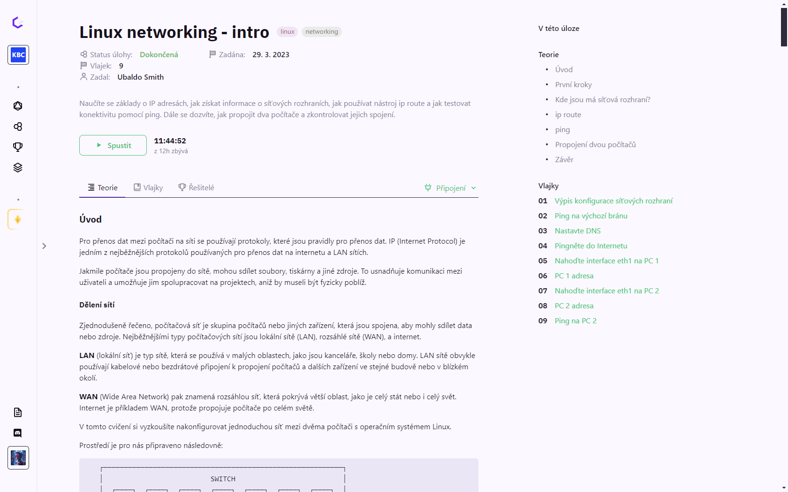

# Nastavení světlého módu

Jelikož může být běžné zobrazení stránky HAXAGON nečitelné na některých projektorech, existuje možnost přepnout rozhraní do bílého módu.

Tato možnost zvýší kontrast textu v popiscích úloh (pozadí na bílo, text na černo).

Světlý mód je možné zapnout v uživatelských nastaveních, které otevřete kliknutím na své jméno a profilový obrázek v levém dolním rohu a vybráním možnosti "Nastavení".  
Ve spodní části nastavení se nachází možnost "Mód zobrazení", kde pro světlý režim vyberte "Projektor".

::: info Poznámka
Světlý mód není doporučený pro běžné používání na počítačích, obsahuje totiž velmi kontrastní barvy, které mohou být nepříjemné pro běžné čtení. Také s ním není primárně počítáno při grafickém návrhu jednotlivých prvků a stránka obecně vypadá vzhledněji v tmavém režimu.

Světlý mód je určen hlavně pro projektory.
:::