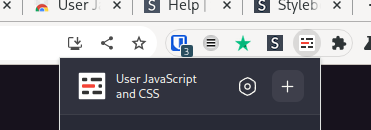
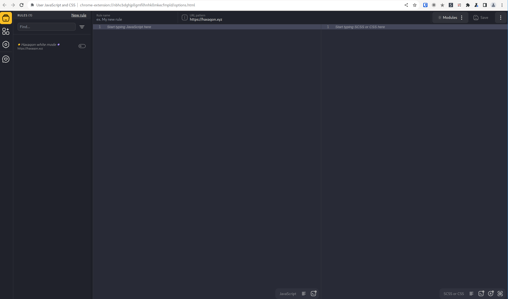
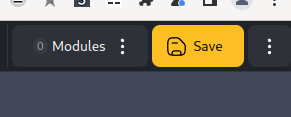

# Nastavení světlého módu pomocí rozšíření prohlížeče

## Chrome/Chromium

Ačkoli na světlém módu již pracujeme, tak jako dočasné řešení nabízíme zesvětlení pomocí přepsání CSS. K tomu lze použít rozšíření do Chrome/Chromium prohlížeče https://chromewebstore.google.com/detail/user-javascript-and-css/nbhcbdghjpllgmfilhnhkllmkecfmpld.
Rozšíření nainstalujte, přejděte na haxagon.xyz a v horním panelu klikněte na ikonku rošíření a následně na znaménko +:



Otevře se editor JS a CSS. Zde je důležité zkontrolovat, že v horní části je adresa https://haxagon.xyz/.



Do pravé části editoru s popiskem "Start typing SCSS or CSS here" vložte následující CSS kód:


```css
#layout {
    background-color: #fff;
}

.bg-grey-dark {
    background-color: #eee;
}

.text-grey-light {
    color: #615b91 !important;
}

.markdown code {
    background-color: #ececec !important;
    color: #4c348e !important;
}

.markdown table {
    background-color: #fff !important;
}

body,
.text-grey,
.markdown pre > code,
.markdown,
.markdown strong,
.markdown h1,
.markdown h2,
.markdown h3,
.markdown h4,
.markdown h5,
.markdown h6,
.markdown h1 > a,
.markdown h2 > a,
.markdown h3 > a,
.markdown h4 > a,
.markdown h5 > a,
.markdown h6 > a {
    color: #000 !important;
}
```

Poté klikněte na tlačítko "Save".



Pak už stačí refrehnout haxagon a stránka by měla být ve světlém módu.


